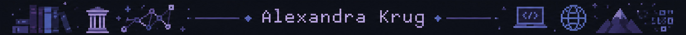

`Digital Humanities · Knowledge Systems · Research Infrastructure`

```text
Hi there 👋

I'm a Digital History researcher and Knowledge Manager interested in
how complex information becomes structured knowledge — and how that
knowledge can become useful infrastructure.
```

:globe_with_meridians: [`Learn more about my work and background.`]()

### ✨ Featured work: Come2Data Knowledge Base
🌐 [`GitLab TUC (Architecture)`](https://gitlab.hrz.tu-chemnitz.de/come2data/c2d_ap2/c2d_knowledgebase) · 🌐 [`GitLab TUC (System)`](https://gitlab.hrz.tu-chemnitz.de/come2data/c2d_ap2/c2d_knowledgebase_system)

```text
STATUS     ███████░░░  ongoing
TYPE       research + educational infrastructure
MODE       architecture + implementation
QUEST      make institutional knowledge + data competencies accessible
```

### 🗂️ Other projects

#### LauGIS - Geoinformationssystem zur Erfassung der Lausitzer Bergbau- und Industriekultur · 🌐 [`GitHub (german)`](https://github.com/LausitzBergbaukultur/LauGIS)

```text
STATUS     ██████████  complete
TYPE       digital humanities + GIS
MODE       research + software
QUEST      document cultural heritage through spatial data
```

#### Master Thesis 'Flüchtig, Anonym & Digital' · 🌐 [`GitHub (german)`](https://krugbuild.github.io/fluechtig-anonym-digital/)
  
```text
STATUS     ██████████  archived
RELEASED   30.05.2024 (revised version)
TYPE       digital history + source criticism
MODE       research + methodology
QUEST      understand how genuine digital sources change historical research
```
